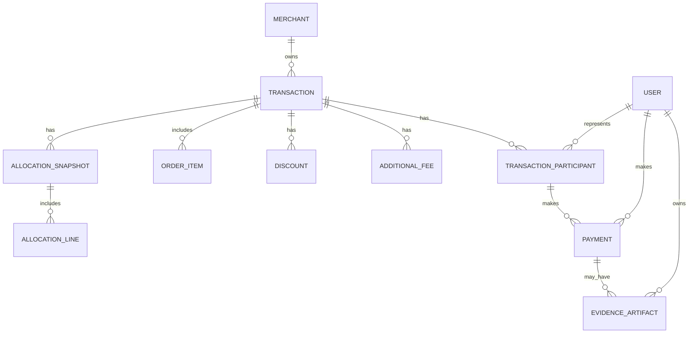

# Domain Model & ERD 🧩

**Goal:** Definisikan entitas inti, lifecycle, versioning, dan hubungannya.

## Core Entities (singkat)
- **User** (id, username, npp, password_hash, name, phone, created_at, last_login)
- **Merchant** (id, name)
- **Transaction** (id, merchant_id, ordered_at, currency, notes, state, current_version)
- **TransactionParticipant** (id, transaction_id, user_id, role, confirmed)
- **OrderItem** (id, transaction_id, name, normal_price, qty, owner_participant_id)
- **Discount** (id, transaction_id, type, scope, percent_or_amount, priority, enabled)
- **AdditionalFee** (id, transaction_id, type, amount, allocation_method)
- **AllocationSnapshot** (id, transaction_id, version, locked_at, totals jsonb, checksum)
- **AllocationLine** (id, snapshot_id, participant_id, subtotal, discount_share, fee_share, rounding_adjustment, final_due)
- **Payment** (id, participant_id, snapshot_id, status, amount_paid, paid_at, method, reference)
- **EvidenceArtifact** (id, owner_id, object_ptr, meta)
- **AuditLog** (id, event_type, actor_id, timestamp, object_type, object_id, diff jsonb)

## Entity Details — kegunaan tiap entitas
Berikut penjelasan singkat fungsi dan kegunaan setiap entitas dalam domain model.

- **User**
  - Identitas dan kredensial (username, npp, password_hash) plus profil (name, phone). `password_hash` harus menggunakan algoritma yang aman (bcrypt/argon2). Users berperan sebagai `actor` dalam audit, owner untuk bukti (EvidenceArtifact), dan pemilik per-participant/pembayaran.
  - Kebijakan: jangan expose `password_hash` dalam API responses; gunakan JWT atau session untuk authentication, dan pertimbangkan rate-limiting pada endpoint login.

- **Merchant**
  - Menyimpan metadata pemilik/order source (mis. restoran). Digunakan untuk kebijakan spesifik merchant, pengaturan rounding/defaults, dan pengelompokan transaksi.

- **Merchant**
  - Menyimpan metadata pemilik/order source (mis. restoran). Digunakan untuk kebijakan spesifik merchant, pengaturan rounding/defaults, dan pengelompokan transaksi.

- **Transaction**
  - Representasi event pemesanan/checkout; menjadi root aggregate yang mengikat peserta, item, diskon, dan biaya tambahan. Menyimpan lifecycle state (`DRAFT`/`PUBLISHED`/`SETTLED`/`ARCHIVED`) dan pointer `current_version` ke snapshot aktif.

- **TransactionParticipant**
  - Mewakili user per transaksi (peran: Initiator/Payer/Participant). Menyimpan status konfirmasi, relasi ke item yang mereka miliki, dan/payments yang dibuat.

- **OrderItem**
  - Item yang dipesan (nama, harga normal, qty) dan pemiliknya (`owner_participant_id`). Mendukung diskon item-scoped yang hanya mengurangi total pemilik item tersebut.

- **Discount**
  - Definisi potongan: `PERCENT` atau `FIXED_AMOUNT`; scope: `TRANSACTION_WIDE` | `ITEM_SCOPED` | `PARTICIPANT_SCOPED`. Menyertakan aturan penumpukan (priority) dan flag `enabled` untuk menyalakan/mematikan diskon.

- **AdditionalFee**
  - Biaya tambahan (delivery/service/packaging) dengan `allocation_method` (EQUAL | PROPORTIONAL | CUSTOM). Untuk `CUSTOM`, sistem memvalidasi bahwa penjumlahan alokasi peserta sama dengan total biaya.

- **AllocationSnapshot**
  - Hasil kalkulasi yang *terkunci* pada suatu versi: menyimpan `version`, `locked_at`, `totals` (JSON), `checksum`/hash, dan kebijakan rounding yang dipakai. Digunakan sebagai sumber kebenaran (single source of truth) untuk audit, export, dan rekonsiliasi.

- **AllocationLine**
  - Baris per-participant di dalam snapshot yang menyimpan detail angka: `subtotal`, `discount_share`, `fee_share`, `rounding_adjustment`, dan `final_due`. `final_due` adalah kewajiban akhir peserta dan menjadi dasar pembuatan `Payment` serta notifikasi/reminder. Penting: Σ(final_due) harus sama persis dengan `grand_total` pada snapshot.

- **Payment**
  - Melacak status pembayaran per peserta per snapshot (status: unpaid/partial/paid/verified), jumlah yang dibayar, waktu, metode, dan referensi. Mendukung pembayaran parsial dan rujukan ke bukti `EvidenceArtifact`.

- **EvidenceArtifact**
  - Pointer aman ke bukti (receipt/transfer proof/promo proof) di object storage (S3/GCS). Berisi metadata, pemilik, dan digunakan saat verifikasi oleh finance/auditor.

- **AuditLog**
  - Append-only log yang merekam setiap mutasi (event_type, actor, timestamp, object, diff). Digunakan untuk rekonstruksi perubahan, bukti kepatuhan, dan insiden audit.

## Lifecycle & Versioning
- Lifecycle states: `DRAFT` → `PUBLISHED` → `SETTLED` → `ARCHIVED`
- Publishing creates an immutable `AllocationSnapshot` version (incrementing `version`).
- All mutations write an `AuditLog` (append-only) with diffs and actor info.

## Relationships (textual)
- User 1..* TransactionParticipant
- User 1..* Payment
- User 1..* EvidenceArtifact (owner)
- Transaction 1..* TransactionParticipant
- Participant 1..* OrderItem
- Transaction 0..* Discount
- Transaction 0..* AdditionalFee
- Transaction 1..* AllocationSnapshot
- AllocationSnapshot 1..* AllocationLine
- Participant 0..* Payment
- Transaction/Payment 0..* EvidenceArtifact
- All objects 0..* AuditLog

## ERD (Mermaid)

Refer to `docs/example-schemas.md` for table definitions and sample DTOs.
